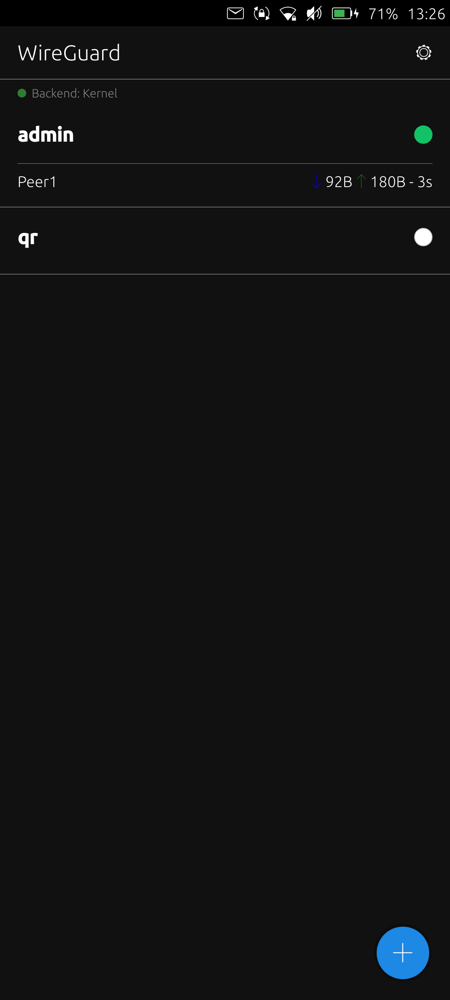
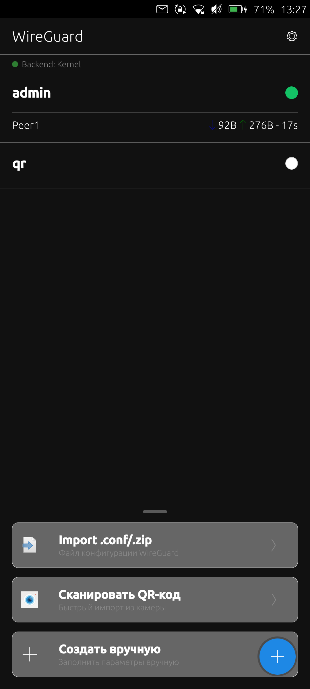
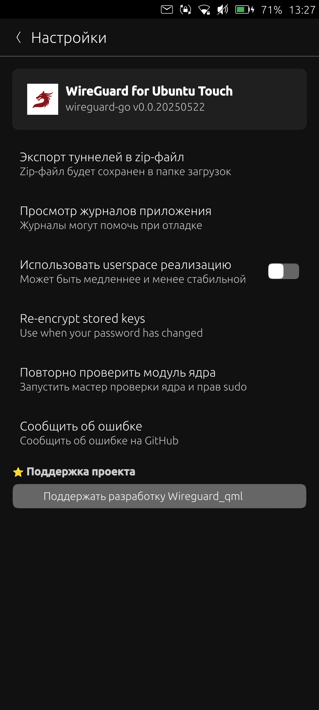

# Wireguard voor Ubuntu Touch

Fork van het originele wireguard_qml, aangepast en onderhouden voor Ubuntu‑Touch‑communityapparaten.

## Functies
- Userspace‑fallback (wireguard‑go) als de kernelmodule ontbreekt
- QR/zip/import‑support voor .conf‑configuraties
- Extra routes en DNS per profiel
- PreUp‑hooks (commando’s vóór het omhoogbrengen van de interface)
- Root‑only opslag van private keys (0600) onder `/home/phablet/.local/share/wireguard.sysadmin/keys`

## Screenshots




## Bouwen & installeren
Vereisten: `clickable` ≥ 8.6, Docker beschikbaar, Ubuntu SDK 20.04‑image.

```bash
clickable build --arch arm64  # voor apparaat
clickable install --arch arm64 --ssh <device-ip>
```

Voor emulator (x86_64): `clickable build --arch amd64`.

## Logs
Applicatielogs staan in `~/.cache/wireguard.sysadmin/`. Open Instellingen en tik op “View application logs” om erheen te gaan.

## Kernelmodules
Als je kernel een WireGuard‑module heeft, wordt die gebruikt; anders valt de app terug op userspace.
WireGuard aan een UT‑kernel toevoegen: https://www.wireguard.com/compilation/

## Configs exporteren
Alle profielen kunnen worden geëxporteerd via Instellingen → “Export tunnels to zip file” naar `/home/phablet/Downloads/wireguard.zip` (bestand wordt automatisch genummerd bij bestaande naam).

## PreUp (gebruik)
PreUp wordt **voor** het omhoogbrengen van de interface uitgevoerd. Handig voor voorbereidende taken (routes, regels, enz.).

Stappen:
1. Open een profiel.
2. Vul het veld “PreUp command” in.
3. Scheid meerdere commando’s met `;` of zet ze op aparte regels.

Voorbeeld:
```
ip rule add fwmark 51820 table 51820
ip route add default dev wg0 table 51820
```

## Wijzigingen & functielijst
Zie `docs/CHANGES.nl.md`.

## ⭐ Ontwikkeling ondersteunen
YooMoney:
https://yoomoney.ru/to/4100119470150396

Donaties ondersteunen de ontwikkeling van open-sourceprojecten.

## Maintainer
Sysadmin <bytebuddy@yandex.ru>

## Licentie
Dit project is een fork van [Wireguard_qml](https://github.com/DavidVentura/Wireguard_qml) (MIT).  
Onze aanpassingen vallen ook onder de MIT‑licentie.

Copyright (c) 2026 Sysadmin  
Copyright (c) 2021 David Ventura
